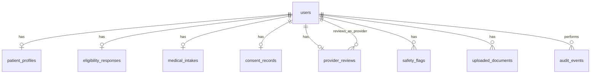

# Aretide Database Schema & Design Decisions

> **Acronyms:** See [../README.md](../README.md#glossary-acronyms-used-in-this-repo) for the full glossary. Key terms here: **MVP** (Minimum Viable Product), **API** (Application Programming Interface), **HIPAA** (Health Insurance Portability and Accountability Act), **PHI** (Protected Health Information), **EHR** (Electronic Health Record), **JSON** (JavaScript Object Notation), **RBAC** (Role-Based Access Control), **UUID** (Universally Unique Identifier).

This document explains every Django database table, how they relate, and why the schema was designed this way.

---

## Where the design came from

The tables were driven by three inputs:

1. **MVP launch plan** — [Starting Point/launchPlan.md](../Starting%20Point/launchPlan.md): Steps 2–8 map to funnel → account → intake → consent → dashboards. Steps 9–11 (turnkey partner, pharmacy, Stripe) are post-schema integrations. Steps 13+ are explicitly out of MVP scope.
2. **Patient flow (Steps 2–5)** — Anonymous qualification funnel → account creation (claim draft) → full medical intake → consent → case submitted. See [Anonymous funnel session (pre-account)](#anonymous-funnel-session-pre-account).
3. **Frontend types** — [`src/lib/types/mvp.ts`](../src/lib/types/mvp.ts) defines the API contract between React and Django.
4. **HIPAA / telehealth constraints** — Separate sensitive data, audit PHI (Protected Health Information) access, encrypt high-risk fields, keep the MVP small (no billing, pharmacy APIs, messaging, etc. until Steps 9–11).

The goal was a **minimum schema that matches the existing app**, not a full EHR.

---

## Entity relationship (high level)



Almost everything hangs off **`users`** — one person, one patient record.

Pre-account progress is stored **server-side** and linked to the browser via an anonymous funnel session (see below) — not via `localStorage` and not keyed by IP address.

---

## Anonymous funnel session (pre-account)

This section defines **required behavior** to implement next. The current frontend still has a **temporary** `localStorage` fallback in [`src/lib/storage.ts`](../src/lib/storage.ts) when `VITE_API_URL` is unset — **remove this**; PHI must never be stored in the browser.

### Product flow

A new visitor should be able to:

1. Land on `/qualify` with **no account**.
2. Answer the **pre-account eligibility steps** (roughly six screens: basic metrics, location, treatment interest, safety screen, review — exact step order may change in UI).
3. **Close the tab, refresh, or open a new tab** in the same browser and resume where they left off.
4. Hit an **account-creation gate** — registration is required before continuing to `/intake`.
5. On successful registration, the server **claims** the anonymous draft and attaches it to the new `users` row (and `eligibility_responses`).
6. Continue the journey as an authenticated patient (`Authorization: Token …` on `/me/` endpoints).

“No account” does **not** mean “no persistence.” It means the patient is identified by a **server-side anonymous session**, not by email/password yet.

### What must NOT be used for PHI

| Mechanism | Allowed for pre-account PHI? | Why |
|-----------|------------------------------|-----|
| `localStorage` / `sessionStorage` for quiz answers | **No** | Not HIPAA-compliant; visible to any script on the page |
| IP address as the primary session key | **No** | Unstable (mobile, VPN, NAT); not a reliable per-person identifier |
| Client-only state with no server save | **No** | Lost on refresh; cannot be linked at registration |

### What the browser may store

| Item | Storage | Contents |
|------|---------|----------|
| Funnel session cookie | `HttpOnly`, `Secure`, `SameSite=Lax` (or `Strict`) cookie | **Opaque session ID only** — never eligibility answers |
| Auth token (after register/login) | `localStorage` or memory (existing [`client.ts`](../src/lib/api/client.ts) pattern) | API token string — not clinical content |

The cookie is how Hims-style funnels remember progress across refresh and new tabs: the browser resends the cookie; the **server** returns saved answers.

### Server-side requirements

1. **Create session on funnel start** — First visit to `/qualify` (or first save) creates a `funnel_sessions` row (or equivalent) with a cryptographically random ID.
2. **Set cookie** — Response includes `Set-Cookie` with the opaque ID. Use a reasonable TTL (e.g. 7–30 days) and `expires_at` on the server row for cleanup.
3. **Save incrementally** — Each step `PATCH`es draft eligibility fields to the server, keyed by funnel session ID from the cookie. Do not wait until “Finish” to persist.
4. **Restore on load** — `GET` current funnel draft when `/qualify` loads; pre-fill the form from the API response.
5. **Claim on register** — `POST /api/auth/register/` must accept the funnel cookie (or explicit session header). In one transaction:
   - Create `users` (+ `authtoken_token`).
   - Move or copy draft data into `eligibility_responses` with `user_id` set.
   - Mark funnel session `claimed_at` / bind `claimed_by_user_id`.
   - Return auth token; optionally clear or rotate the funnel cookie.
6. **Login path** — If the user already has an account, `POST /api/auth/login/` should not orphan an anonymous draft; either merge draft into existing eligibility (if empty) or discard with audit metadata (product decision).
7. **Expiry** — Cron or management command deletes unclaimed funnel sessions past `expires_at`.
8. **Audit** — When PHI in a funnel draft is read or updated, write `audit_events` (same as post-account PHI).

IP address may be logged for fraud/rate-limiting, but must **not** be the primary key for “remember my answers.”

### Proposed schema addition

Not implemented yet. Recommended shape:

**`funnel_sessions`**

| Field | Purpose |
|-------|---------|
| `id` (UUID) | Primary key |
| `token` | Opaque value sent in cookie (store hashed if paranoia warrants) |
| `expires_at` | Server-side TTL |
| `claimed_at`, `claimed_by_user_id` (nullable FK → `users`) | Set when registration links the draft |
| `created_at`, `updated_at` | Housekeeping |

Draft eligibility data can either:

- Live in **`eligibility_responses`** with `user_id` **nullable** and `funnel_session_id` set until claim, or
- Live as JSON on `funnel_sessions` until claim, then normalize into `eligibility_responses`.

Prefer **nullable `user_id` on `eligibility_responses`** plus `funnel_session_id` so the same table and API shape apply before and after account creation.

### Proposed API endpoints (pre-account)

| Method | Path | Auth | Purpose |
|--------|------|------|---------|
| POST | `/api/funnel/session/` | Public (sets cookie) | Create anonymous session |
| GET | `/api/funnel/eligibility/` | Funnel cookie | Load draft for current browser |
| PATCH | `/api/funnel/eligibility/` | Funnel cookie | Save current step |
| POST | `/api/auth/register/` | Public + funnel cookie | Create account **and** claim draft |

After claim, use existing authenticated routes (`GET/PATCH /api/eligibility/me/`, etc.).

### Frontend implementation notes

- [`src/routes/qualify.tsx`](../src/routes/qualify.tsx) should call funnel `PATCH` on each “Continue” (when `VITE_API_URL` is set), not only on final submit.
- Account step moves **after** pre-account questions (current prototype collects account at step 2 — production order should match the product flow above).
- [`src/lib/api/client.ts`](../src/lib/api/client.ts): add funnel helpers; keep PHI off `localStorage` except the auth token.
- [`src/lib/types/mvp.ts`](../src/lib/types/mvp.ts): types may gain optional `funnel_session_id` or nullable `user_id` on drafts.

### Verification checklist (when building)

- [ ] Fill step 1, refresh — answers restored from API, not `localStorage`.
- [ ] Fill step 1, close tab, open new tab to `/qualify` — same draft (cookie sent).
- [ ] Clear site cookies — draft gone (proves server + cookie, not IP).
- [ ] Complete pre-account steps, register — `eligibility_responses.user_id` populated; `/intake` sees data.
- [ ] Incognito vs normal window — separate drafts (separate cookies).

---

## Table-by-table breakdown

### 1. `users`

**Purpose:** Login, identity, and roles.

| Field | Why |
|-------|-----|
| `email` | Login identifier (replaces username) — matches frontend auth flow |
| `first_name`, `last_name` | Collected at account creation in `/qualify` |
| `phone`, `dob` (date of birth) | PHI (Protected Health Information) — stored with field-level encryption (`EncryptedCharField` / `EncryptedDateField`) |
| `state` | Colorado gate — default `"Colorado"`, validated on register |
| `is_patient`, `is_provider`, `is_staff` | RBAC (Role-Based Access Control): patients use `/me/` endpoints; providers use `/api/admin/` |
| UUID `id` | Universally Unique Identifier — matches frontend `User.id` strings; safe for APIs |

**Decision:** Custom `User` model instead of Django’s default, because the app needs email login, patient vs provider roles, and encrypted PHI fields from day one.

Django also creates related auth tables (`auth_permission`, `django_session`, etc.) and **`authtoken_token`** for API tokens (`Authorization: Token …`), matching [`src/lib/api/client.ts`](../src/lib/api/client.ts).

**Model:** [`apps/accounts/models.py`](apps/accounts/models.py)

---

### 2. `patient_profiles`

**Purpose:** Extended contact info from the **full medical intake** (Step 1: address, emergency contact).

| Field | Why |
|-------|-----|
| `address`, `emergency_contact_*` | Encrypted — more sensitive than eligibility city/ZIP |
| `city`, `state`, `zip_code` | Plain text — useful for provider list/filtering |
| One-to-one with `users` | One patient = one profile |

**Decision:** Split from `users` because:

- Account creation only needs name, email, phone, DOB (date of birth), state.
- Full address and emergency contact come **later** in the 12-step intake.
- Keeps `users` lean for auth; profile can be empty until intake Step 1 is filled.

**Note:** The profile model exists, but much intake identity data currently lives in `medical_intakes.identity` (JSON) as the frontend sends it. The profile table is ready for when that data is normalized server-side.

**Model:** [`apps/patients/models.py`](apps/patients/models.py)

---

### 3. `eligibility_responses`

**Purpose:** The **short eligibility quiz** before/during account creation (height, weight, Colorado, treatment interest, safety screen).

**Pre-account:** Rows may exist with `user_id` null while tied to a `funnel_sessions` record; registration claims the row. See [Anonymous funnel session](#anonymous-funnel-session-pre-account).

| Field | Why |
|-------|-----|
| Structured columns (`height_ft`, `weight`, `bmi`, etc.) | Used in provider admin list — easy to query without parsing JSON |
| `safety_screen` (JSON) | Flexible yes/no map for safety questions — avoids many similar columns |
| `safety_concern_flag` | Denormalized boolean for quick “needs review” without re-scanning JSON (JavaScript Object Notation) |
| `bmi` | Computed server-side (same logic as frontend) so the value is trustworthy |
| One-to-one with `users` | One eligibility snapshot per patient for MVP (after claim; pre-account draft may have null `user_id`) |

**Decision:** Eligibility is **its own table**, not part of `medical_intakes`, because:

- The product treats it as a **separate step** with different UI and timing.
- Providers care about treatment interest, budget, and BMI **before** reading the full chart.
- Patients can be blocked or flagged at eligibility without a complete intake.

**Model:** [`apps/eligibility/models.py`](apps/eligibility/models.py)

---

### 4. `medical_intakes`

**Purpose:** The **full 12-step medical questionnaire** — the bulk of clinical PHI (Protected Health Information).

| Field | Why |
|-------|-----|
| `status` | Drives patient dashboard: draft → submitted → under_review → approved, etc. |
| `identity`, `body_metrics`, `weight_history`, … (JSON) | Each JSON blob = one intake step from the frontend |
| `submitted_at` | Set when consent is signed / intake is finalized |
| One-to-one with `users` | One active intake per patient for MVP |

**JSON sections:**

| Column | Intake step |
|--------|-------------|
| `identity` | Identity & contact |
| `body_metrics` | Body metrics & goals |
| `weight_history` | Weight-loss history |
| `medical_conditions` | Medical conditions |
| `family_history` | Family history |
| `medications` | Current medications |
| `allergies` | Allergies |
| `pregnancy` | Pregnancy & reproductive health |
| `lifestyle` | Lifestyle & behavior |
| `labs` | Labs & vitals |
| `medication_preferences` | Medication preferences |
| `safety_acknowledgments` | Safety acknowledgments |

**Decision — JSON vs hundreds of columns:**

The intake has dozens of questions, many conditional (medication lists, allergy lists). For MVP, **JSON columns mirror the frontend shape exactly**:

- Faster to build and sync with [`src/routes/intake.tsx`](../src/routes/intake.tsx)
- No migration every time a question is tweaked
- **Tradeoff:** harder to SQL (Structured Query Language)-query individual answers later (normalize in v2 if needed)

This is a deliberate **speed-over-normalization** choice for MVP.

**Model:** [`apps/intakes/models.py`](apps/intakes/models.py)

---

### 5. `safety_flags`

**Purpose:** Auto-generated alerts for providers (BMI &lt; 27, pregnancy, insulin use, etc.).

| Field | Why |
|-------|-----|
| `flag_type`, `severity`, `description` | Matches frontend `SafetyFlag` type and MVP flag list |
| ForeignKey to `users` (not one-to-one) | A patient can have **many** flags |
| Recreated on consent submit | Flags are recomputed from eligibility + intake + consent |

**Decision:** Separate table instead of a JSON array on intake because:

- Provider admin UI lists **flag count** per patient.
- Flags are **derived data** — recomputed when intake is submitted, not entered by the patient.
- Audit and reporting are easier per flag row.

**Logic:** [`apps/intakes/services.py`](apps/intakes/services.py) (ported from [`src/lib/safety-flags.ts`](../src/lib/safety-flags.ts))

**Model:** [`apps/intakes/models.py`](apps/intakes/models.py) (`SafetyFlag`)

---

### 6. `consent_records`

**Purpose:** Legal telehealth consent — **immutable** after signing.

| Field | Why |
|-------|-----|
| Six boolean acknowledgments | Matches consent page sections |
| `typed_signature`, `signed_at` | Legal record of who agreed and when |
| One-to-one with `users` | One consent record per intake submission |

**Decision:** Separate table (not JSON on intake) because:

- Consent is a **legal artifact** — should not change when intake is edited.
- API rejects a second POST — consent is write-once.
- Signing consent **triggers** intake `status → submitted` and safety flag computation.

**Model:** [`apps/consents/models.py`](apps/consents/models.py)

---

### 7. `uploaded_documents`

**Purpose:** Metadata for lab results, ID, and insurance card uploads.

| Field | Why |
|-------|-----|
| `document_type` | Enum: `lab_results`, `insurance_card`, `photo_id`, `other` |
| `file_key` | S3 (Amazon Simple Storage Service) object key — **file bytes are not in Postgres** |
| `original_filename`, `content_type` | Display and validation |
| ForeignKey to `users` | One patient, many documents |

**Decision:** Store **metadata in DB, files in S3** because:

- HIPAA: large binaries belong in encrypted object storage (SSE-KMS (Server-Side Encryption with AWS Key Management Service)), not the database.
- API returns a **presigned upload URL** (Uniform Resource Locator); client uploads directly to S3.
- Matches the MVP `uploaded_documents` spec without building file storage into Django.

**Model:** [`apps/documents/models.py`](apps/documents/models.py)

---

### 8. `provider_reviews`

**Purpose:** Provider/admin decisions on a patient.

| Field | Why |
|-------|-----|
| `status` | Patient-facing status (synced back to `medical_intakes.status`) |
| `decision` | Clinical disposition: `needs_more_info`, `approved`, `labs_required`, etc. |
| `internal_note` | Provider-only |
| `patient_note` | Shown on patient dashboard |
| `reviewer` | Which provider reviewed (FK (foreign key) to `users`) |
| One-to-one with `users` (patient) | One review record per patient for MVP |

**Decision:** Separate from `medical_intakes` because:

- Intake = **patient-authored** data; review = **provider-authored** data.
- Different permissions (only providers write here).
- Matches admin UI in [`src/routes/admin.$patientId.tsx`](../src/routes/admin.$patientId.tsx).

The software does **not** auto-prescribe — it only stores the provider’s manual decision.

**Model:** [`apps/reviews/models.py`](apps/reviews/models.py)

---

### 9. `audit_events`

**Purpose:** HIPAA-style access logging — **who touched what PHI (Protected Health Information), when**.

| Field | Why |
|-------|-----|
| `action` | `read` / `create` / `update` / `login` / `logout` |
| `resource_type`, `resource_id` | e.g. `medical_intake`, `patient` — **not** the PHI itself |
| `ip_address`, `user_agent` | Forensics |
| Indexed on `user` + `resource` | Queryable for compliance reviews |

**Decision:** Added beyond the original MVP table list because:

- HIPAA requires accounting of PHI access.
- Real patient data requires audit logs in production.
- Logs store **metadata only** — never intake contents.

**Model:** [`apps/audit/models.py`](apps/audit/models.py)

---

## Design patterns and tradeoffs

| Choice | Rationale |
|--------|-----------|
| **UUID primary keys** | Universally Unique Identifier — match frontend `crypto.randomUUID()`; safe in APIs; no sequential ID leaking |
| **One-to-one** for eligibility, intake, consent, review | MVP (Minimum Viable Product) = one patient, one journey; simplifies `/me/` endpoints |
| **JSON on intake** | JavaScript Object Notation — matches React form structure; fastest path to MVP |
| **Structured columns on eligibility** | Small, fixed questionnaire; used in admin list views |
| **Encryption on phone/DOB/address** | Defense in depth on top of disk encryption (DOB = date of birth) |
| **Colorado validation in API** | UI-only gates are not enough for compliance |
| **Token auth** | Frontend already sends `Authorization: Token …` |

---

## What was intentionally not modeled

Per MVP scope, there are **no tables** for:

- Insurance claims / billing
- Prescriptions / pharmacy routing
- Messaging / chat
- Appointments / video visits
- Multi-state licensing
- Provider scheduling

Those would be new tables in a later phase.

---

## Data flow through the tables

```
Funnel start                → funnel_sessions (+ Set-Cookie)
Each qualify step           → eligibility draft (server, keyed by funnel session)
Register (with funnel cookie)→ users
                            → eligibility_responses (draft claimed, user_id set)
                            → funnel_sessions.claimed_at
Medical questionnaire       → medical_intakes (status=draft, JSON filling up)
Consent signed              → consent_records
                            → medical_intakes.status=submitted
                            → safety_flags (recomputed)
Provider opens admin        → audit_events (read)
                            → provider_reviews (update)
Patient uploads ID/labs     → uploaded_documents + S3 file
```

---

## API mapping

| Table | Primary API endpoints |
|-------|----------------------|
| `funnel_sessions` (proposed) | `POST /api/funnel/session/`, `GET/PATCH /api/funnel/eligibility/` |
| `users` | `POST /api/auth/register/` (claims funnel), `login/`, `logout/` |
| `eligibility_responses` | Pre-account: funnel `GET/PATCH`; after account: `GET/PATCH /api/eligibility/me/`, `POST /api/eligibility/` |
| `medical_intakes` | `GET/PATCH /api/medical-intakes/me/` |
| `consent_records` | `GET/POST /api/consent-records/me/` |
| `uploaded_documents` | `GET/POST /api/documents/` |
| `provider_reviews` | `GET/PATCH /api/admin/patients/{id}/`, `POST /api/provider-reviews/` |
| `safety_flags` | Included in admin patient detail response |
| `audit_events` | Written automatically by backend services (not a public patient API) |
| Dashboard aggregate | `GET /api/dashboard/me/` |

---

## Frontend type mapping

| Django model | TypeScript interface (`src/lib/types/mvp.ts`) |
|--------------|-----------------------------------------------|
| `User` | `User` |
| `PatientProfile` | `PatientProfile` |
| `EligibilityResponse` | `EligibilityResponses` |
| `MedicalIntake` | `MedicalIntake` |
| `ConsentRecord` | `ConsentRecord` |
| `SafetyFlag` | `SafetyFlag` |
| `ProviderReview` | `ProviderReview` |
| `UploadedDocument` | (intake uploads — `document_type`, `file_url` via API) |
| `AuditEvent` | (backend only — no frontend type) |

---

## Future normalization (v2+)

If you need reporting or clinical decision support on individual intake answers:

1. Extract high-value fields from JSON into columns (e.g. `current_insulin_use`, `pregnant`).
2. Move `medical_intakes.identity` into `patient_profiles` on save.
3. Add normalized child tables for `medications`, `allergies`, and prior GLP-1 (glucagon-like peptide-1) use.
4. Keep JSON as a snapshot or drop it once normalized.

For MVP, JSON is the right tradeoff. For scale and analytics, normalize incrementally.

---

## Related documentation

- [../README.md](../README.md) — **Project documentation index** (start here)
- [README.md](README.md) — Backend setup, API, how to run locally
- [DATABASE.md](DATABASE.md) — Tables, schema decisions, data flow
- [HOSTING.md](HOSTING.md) — Heroku Shield vs AWS (Amazon Web Services) for PHI (Protected Health Information)
- [deploy/aws.md](deploy/aws.md) — AWS deployment outline
