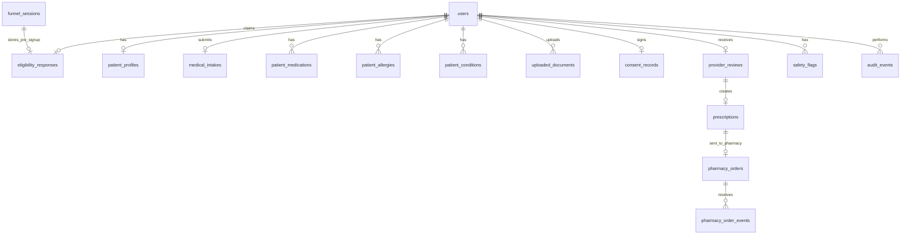

# Aretide Intake Schema v2

> **Launch plan:** [Starting Point/launchPlan.md](../Starting%20Point/launchPlan.md) — Step 2 (qualification funnel), Step 4 (full medical intake), Step 5 (consent). Steps 9–10 cover turnkey partner and pharmacy integrations.

This schema reflects the updated GLP-1 telehealth flow:

1. Anonymous pre-signup qualification
2. Account creation / identity capture
3. Full medical intake before clinician review
4. Clinician review and prescription decision
5. Pharmacy fulfillment via MediVera/Life File-style order API
6. Pharmacy status/shipping updates back into Aretide

The design keeps marketing qualification, clinical intake, provider review, prescription, and pharmacy fulfillment separate.

---

## High-level entity relationship



---

# 1. `funnel_sessions`

## Purpose

Stores the anonymous pre-account qualification session. The browser only stores an opaque secure cookie. No PHI should be stored in `localStorage`.

## Fields

| Field | Type | Notes |
|---|---|---|
| `id` | UUID PK | Internal ID |
| `token_hash` | string, unique | Hash of opaque cookie token |
| `status` | enum | `active`, `claimed`, `expired`, `abandoned` |
| `claimed_by_user_id` | FK nullable → `users.id` | Set after account creation |
| `claimed_at` | datetime nullable | When session was linked to account |
| `expires_at` | datetime | 7-30 day TTL |
| `ip_address` | inet nullable | Fraud/rate-limit metadata only |
| `user_agent` | text nullable | Fraud/rate-limit metadata only |
| `created_at` | datetime |  |
| `updated_at` | datetime |  |

---

# 2. `users`

## Purpose

Authentication, core identity, and role control.

## Fields

| Field | Type | Notes |
|---|---|---|
| `id` | UUID PK |  |
| `email` | string unique | Login identifier |
| `password_hash` | string | Django auth |
| `first_name` | encrypted string | Legal first name |
| `last_name` | encrypted string | Legal last name |
| `phone` | encrypted string | Required for clinical/pharmacy workflow |
| `dob` | encrypted date | Required for eligibility and pharmacy order |
| `state` | string(2) | Residence/licensure gate |
| `is_patient` | boolean |  |
| `is_provider` | boolean |  |
| `is_staff` | boolean |  |
| `created_at` | datetime |  |
| `updated_at` | datetime |  |

---

# 3. `patient_profiles`

## Purpose

Stores extended patient identity/contact information needed for clinician review and pharmacy fulfillment.

## Fields

| Field | Type | Notes |
|---|---|---|
| `id` | UUID PK |  |
| `user_id` | OneToOne FK → `users.id` |  |
| `legal_first_name` | encrypted string | Can mirror `users.first_name` |
| `legal_last_name` | encrypted string | Can mirror `users.last_name` |
| `middle_name` | encrypted string nullable | Pharmacy API supports it |
| `sex_assigned_at_birth` | enum | `male`, `female`, `intersex`, `unknown` |
| `gender_identity` | enum/string nullable | Patient-reported |
| `ethnicity` | string nullable | Optional |
| `address_line_1` | encrypted string | Required before pharmacy order |
| `address_line_2` | encrypted string nullable |  |
| `address_line_3` | encrypted string nullable |  |
| `city` | string |  |
| `state` | string(2) |  |
| `zip_code` | string |  |
| `country` | string(2) default `US` |  |
| `preferred_contact_method` | enum | `email`, `sms`, `phone` |
| `sms_opt_in` | boolean |  |
| `emergency_contact_name` | encrypted string nullable | Optional |
| `emergency_contact_phone` | encrypted string nullable | Optional |
| `created_at` | datetime |  |
| `updated_at` | datetime |  |

---

# 4. `eligibility_responses`

## Purpose

Stores the pre-signup and early post-signup qualification answers.

This is not the full medical intake. This is the short conversion/eligibility layer.

## Fields

| Field | Type | Notes |
|---|---|---|
| `id` | UUID PK |  |
| `funnel_session_id` | FK nullable → `funnel_sessions.id` | Used before account claim |
| `user_id` | OneToOne FK nullable → `users.id` | Set after registration |
| `treatment_interest` | enum | `glp1_pills`, `glp1_injections`, `provider_recommendation`, `not_sure` |
| `primary_goal` | enum/string | `lose_weight`, `metabolic_health`, `learn_options`, etc. |
| `treatment_priority` | enum/string | `cost`, `fda_approved`, `results`, `convenience`, `provider_support` |
| `target_weight_loss_range` | enum | `1_15`, `16_50`, `51_100`, `100_plus`, `not_sure` |
| `state` | string(2) | State availability gate |
| `is_18_or_older` | boolean | Pre-DOB age gate |
| `height_ft` | integer nullable | Can be collected pre- or post-signup |
| `height_in` | integer nullable |  |
| `weight_lbs` | decimal nullable |  |
| `goal_weight_lbs` | decimal nullable |  |
| `bmi` | decimal nullable | Computed server-side |
| `is_likely_eligible` | boolean nullable | Derived |
| `needs_clinician_review` | boolean default false | Derived |
| `disqualification_reason` | string nullable | Avoid showing too much detail to patient |
| `completed_at` | datetime nullable |  |
| `created_at` | datetime |  |
| `updated_at` | datetime |  |

---

# 5. `medical_intakes`

## Purpose

Stores the visit-specific clinical questionnaire submitted before clinician review.

For MVP, keep this as a versioned JSON snapshot plus a few searchable summary columns. Normalize the recurring lists into child tables.

## Fields

| Field | Type | Notes |
|---|---|---|
| `id` | UUID PK |  |
| `user_id` | OneToOne FK → `users.id` |  |
| `status` | enum | `draft`, `submitted`, `under_review`, `needs_more_info`, `approved`, `denied`, `cancelled` |
| `schema_version` | string | Example: `glp1_weight_loss_v2` |
| `submitted_at` | datetime nullable |  |
| `review_started_at` | datetime nullable |  |
| `chief_goal` | string | Patient goal in their words or selected |
| `goal_weight_lbs` | decimal nullable |  |
| `current_height_ft` | integer |  |
| `current_height_in` | integer |  |
| `current_weight_lbs` | decimal |  |
| `current_bmi` | decimal | Computed server-side |
| `highest_lifetime_weight_lbs` | decimal nullable |  |
| `is_current_weight_highest` | boolean nullable |  |
| `daily_activity_level` | integer | 1-5 scale |
| `raw_answers` | JSONB | Full immutable-ish intake payload |
| `created_at` | datetime |  |
| `updated_at` | datetime |  |

## Suggested `raw_answers` shape

```json
{
  "motivation": {
    "why_lose_weight": ["improve_health", "confidence"],
    "goal_meaning": ["more_energy", "overall_health"],
    "treatment_preference": "provider_recommendation",
    "treatment_priority": "fda_approved"
  },
  "body_metrics": {
    "height_ft": 5,
    "height_in": 10,
    "weight_lbs": 220,
    "goal_weight_lbs": 175,
    "highest_lifetime_weight_lbs": 240,
    "is_current_weight_highest": false,
    "activity_level": 3
  },
  "weight_history": {
    "previous_attempts": ["diet", "exercise", "noom"],
    "prior_weight_loss_medications": [],
    "prior_bariatric_surgery": false
  },
  "glp1_history": {
    "has_taken_glp1": false,
    "current_or_prior_medication": null,
    "current_dose": null,
    "reason_stopped": null,
    "side_effects": []
  },
  "contraindications": {
    "personal_or_family_medullary_thyroid_cancer": false,
    "men2": false,
    "pancreatitis": false,
    "gallbladder_disease": false,
    "kidney_disease": false,
    "liver_disease": false,
    "diabetic_retinopathy": false,
    "gastroparesis": false
  },
  "reproductive_health": {
    "pregnant": false,
    "breastfeeding": false,
    "trying_to_conceive": false
  },
  "eating_disorder_screen": {
    "purging_behavior": false,
    "binge_eating_behavior": false,
    "severe_restriction_fear_weight_gain": false,
    "diagnoses": [],
    "remission_one_year_or_more": null,
    "purged_within_12_months": false
  },
  "lifestyle": {
    "alcohol_use": "occasionally",
    "tobacco_use": "never",
    "recreational_drug_use": "never",
    "sleep_quality": "fair"
  },
  "consents_and_acknowledgments": {
    "telehealth_consent": true,
    "privacy_policy": true,
    "terms": true,
    "medication_risks_reviewed": true,
    "no_emergency_care_acknowledgment": true
  }
}
```

---

# 6. `patient_conditions`

## Purpose

Normalized list of diseases/conditions. Maps directly to MediVera/Life File `clinical[]` records with `type = disease`.

## Fields

| Field | Type | Notes |
|---|---|---|
| `id` | UUID PK |  |
| `user_id` | FK → `users.id` |  |
| `intake_id` | FK nullable → `medical_intakes.id` | Snapshot source |
| `condition_type` | enum | `disease`, `contraindication`, `family_history`, `surgical_history` |
| `code` | string nullable | ICD-10/SNOMED if available |
| `description` | string | Human-readable condition |
| `source` | enum | `patient`, `doctor`, `pharmacist`, `system` |
| `start_date` | date nullable |  |
| `end_date` | date nullable |  |
| `is_active` | boolean default true |  |
| `created_at` | datetime |  |
| `updated_at` | datetime |  |

---

# 7. `patient_medications`

## Purpose

Stores current, prior, and GLP-1 medications. Maps to MediVera/Life File `clinical[]` records with `type = medication`.

## Fields

| Field | Type | Notes |
|---|---|---|
| `id` | UUID PK |  |
| `user_id` | FK → `users.id` |  |
| `intake_id` | FK nullable → `medical_intakes.id` |  |
| `medication_name` | string |  |
| `strength` | string nullable |  |
| `dose` | string nullable |  |
| `frequency` | string nullable |  |
| `route` | string nullable | oral, injection, etc. |
| `medication_category` | enum | `current`, `prior_glp1`, `weight_loss`, `supplement`, `other` |
| `start_date` | date nullable |  |
| `end_date` | date nullable |  |
| `reason_stopped` | text nullable |  |
| `side_effects` | JSONB nullable |  |
| `is_active` | boolean default true |  |
| `created_at` | datetime |  |
| `updated_at` | datetime |  |

---

# 8. `patient_allergies`

## Purpose

Stores medication and non-medication allergies. Maps to MediVera/Life File `clinical[]` records with `type = allergy`.

## Fields

| Field | Type | Notes |
|---|---|---|
| `id` | UUID PK |  |
| `user_id` | FK → `users.id` |  |
| `intake_id` | FK nullable → `medical_intakes.id` |  |
| `allergen` | string |  |
| `allergy_type` | enum | `medication`, `food`, `environmental`, `other` |
| `reaction` | string nullable | Example: hives, anaphylaxis, nausea |
| `severity` | enum nullable | `mild`, `moderate`, `severe`, `unknown` |
| `source` | enum | `patient`, `doctor`, `pharmacist`, `system` |
| `start_date` | date nullable |  |
| `end_date` | date nullable |  |
| `is_active` | boolean default true |  |
| `created_at` | datetime |  |
| `updated_at` | datetime |  |

---

# 9. `safety_flags`

## Purpose

Derived clinical alerts for the provider.

## Fields

| Field | Type | Notes |
|---|---|---|
| `id` | UUID PK |  |
| `user_id` | FK → `users.id` |  |
| `intake_id` | FK nullable → `medical_intakes.id` |  |
| `flag_type` | enum/string | `bmi_low`, `pregnancy`, `pancreatitis`, `men2`, etc. |
| `severity` | enum | `info`, `warning`, `high`, `blocking` |
| `description` | text | Provider-facing explanation |
| `source_field` | string nullable | Which answer triggered it |
| `is_resolved` | boolean default false |  |
| `resolved_by_user_id` | FK nullable → `users.id` | Provider/admin |
| `resolved_at` | datetime nullable |  |
| `created_at` | datetime |  |

---

# 10. `consent_records`

## Purpose

Immutable legal record for telehealth, privacy, prescribing, and medication-risk acknowledgments.

## Fields

| Field | Type | Notes |
|---|---|---|
| `id` | UUID PK |  |
| `user_id` | OneToOne FK → `users.id` |  |
| `telehealth_consent` | boolean |  |
| `hipaa_privacy_acknowledgment` | boolean |  |
| `terms_acceptance` | boolean |  |
| `e_prescribing_consent` | boolean |  |
| `medication_risk_acknowledgment` | boolean |  |
| `no_emergency_care_acknowledgment` | boolean |  |
| `refund_policy_acknowledgment` | boolean |  |
| `typed_signature` | encrypted string |  |
| `ip_address` | inet nullable |  |
| `user_agent` | text nullable |  |
| `signed_at` | datetime |  |

---

# 11. `uploaded_documents`

## Purpose

Stores metadata for photo ID, body photos, labs, insurance cards, or prior prescription evidence.

## Fields

| Field | Type | Notes |
|---|---|---|
| `id` | UUID PK |  |
| `user_id` | FK → `users.id` |  |
| `intake_id` | FK nullable → `medical_intakes.id` |  |
| `document_type` | enum | `photo_id`, `selfie`, `body_front`, `body_side`, `lab_results`, `insurance_card`, `prior_prescription`, `other` |
| `file_key` | string | S3 object key |
| `original_filename` | encrypted string |  |
| `content_type` | string |  |
| `size_bytes` | integer |  |
| `status` | enum | `uploaded`, `verified`, `rejected` |
| `reviewed_by_user_id` | FK nullable → `users.id` |  |
| `reviewed_at` | datetime nullable |  |
| `created_at` | datetime |  |

---

# 12. `provider_reviews`

## Purpose

Stores clinician review state and decision.

This should not be used as a prescription. It is the clinical decision record that may produce a prescription.

## Fields

| Field | Type | Notes |
|---|---|---|
| `id` | UUID PK |  |
| `patient_user_id` | OneToOne FK → `users.id` | Patient |
| `intake_id` | FK → `medical_intakes.id` | Intake reviewed |
| `reviewer_user_id` | FK nullable → `users.id` | Internal or partner clinician |
| `external_review_id` | string nullable | OpenLoop/Wheel/etc. consult ID |
| `status` | enum | `not_started`, `queued`, `under_review`, `needs_more_info`, `approved`, `denied`, `labs_required` |
| `decision` | enum nullable | `approve_prescription`, `deny`, `request_more_info`, `require_labs` |
| `denial_reason` | text nullable |  |
| `internal_note` | text nullable | Provider-only |
| `patient_note` | text nullable | Patient-facing |
| `reviewed_at` | datetime nullable |  |
| `created_at` | datetime |  |
| `updated_at` | datetime |  |

---

# 13. `prescriptions`

## Purpose

Stores the prescription generated by a licensed clinician before sending to MediVera or another pharmacy.

This table exists because MediVera's order API expects prescriber and Rx details. A pharmacy order should not be created until this record exists.

## Fields

| Field | Type | Notes |
|---|---|---|
| `id` | UUID PK |  |
| `patient_user_id` | FK → `users.id` |  |
| `provider_review_id` | FK → `provider_reviews.id` |  |
| `prescriber_user_id` | FK nullable → `users.id` | Internal clinician if applicable |
| `external_prescriber_id` | string nullable | Partner clinician ID |
| `prescriber_npi` | encrypted string | Required for Life File order |
| `prescriber_license_state` | string(2) |  |
| `prescriber_license_number` | encrypted string nullable |  |
| `prescriber_dea` | encrypted string nullable | Required only where applicable |
| `rx_type` | enum | `new`, `refill` |
| `drug_name` | string | Required |
| `drug_strength` | string nullable |  |
| `drug_form` | string nullable | tablet, vial, pen, etc. |
| `quantity` | string |  |
| `quantity_units` | string nullable |  |
| `directions` | text | Sig |
| `refills` | integer default 0 |  |
| `date_written` | date |  |
| `effective_date` | date nullable |  |
| `days_supply` | integer nullable |  |
| `schedule_code` | enum nullable | If applicable |
| `clinical_difference_statement` | text nullable | If needed |
| `status` | enum | `draft`, `signed`, `sent_to_pharmacy`, `cancelled` |
| `signed_at` | datetime nullable |  |
| `created_at` | datetime |  |
| `updated_at` | datetime |  |

---

# 14. `pharmacy_orders`

## Purpose

Represents an order sent to MediVera/Life File or another pharmacy partner.

## Fields

| Field | Type | Notes |
|---|---|---|
| `id` | UUID PK |  |
| `prescription_id` | FK → `prescriptions.id` |  |
| `patient_user_id` | FK → `users.id` | Denormalized for convenience |
| `pharmacy_partner` | enum/string | `medivera`, `other` |
| `external_order_id` | string nullable | Life File/MediVera order ID |
| `external_reference_id` | string nullable | Your reference ID sent to partner |
| `status` | enum | `created`, `submitted`, `received`, `processing`, `shipped`, `delivered`, `cancelled`, `error`, `on_hold` |
| `recipient_type` | enum | `patient`, `clinic` |
| `ship_to_first_name` | encrypted string |  |
| `ship_to_last_name` | encrypted string |  |
| `ship_to_phone` | encrypted string |  |
| `ship_to_email` | encrypted string |  |
| `ship_to_address_line_1` | encrypted string |  |
| `ship_to_address_line_2` | encrypted string nullable |  |
| `ship_to_city` | string |  |
| `ship_to_state` | string(2) |  |
| `ship_to_zip_code` | string |  |
| `ship_to_country` | string(2) default `US` |  |
| `shipping_service_code` | string nullable | Partner-provided |
| `handling_service_code` | string nullable | Partner-provided |
| `submitted_payload` | JSONB | Exact payload sent to pharmacy |
| `last_response_payload` | JSONB nullable | Last response from pharmacy |
| `submitted_at` | datetime nullable |  |
| `created_at` | datetime |  |
| `updated_at` | datetime |  |

---

# 15. `pharmacy_order_events`

## Purpose

Stores inbound webhook/data-push events from MediVera/Life File or other fulfillment partners.

## Fields

| Field | Type | Notes |
|---|---|---|
| `id` | UUID PK |  |
| `pharmacy_order_id` | FK nullable → `pharmacy_orders.id` | Matched after parsing |
| `partner` | enum/string | `medivera`, `lifefile`, etc. |
| `external_order_id` | string nullable |  |
| `event_type` | string | `rx_event`, `order_status_changed`, `shipping_updated`, etc. |
| `status` | string nullable | Partner status |
| `tracking_number` | encrypted string nullable |  |
| `carrier` | string nullable |  |
| `raw_payload` | JSONB | Exact webhook payload |
| `processed_at` | datetime nullable |  |
| `processing_error` | text nullable |  |
| `created_at` | datetime |  |

---

# 16. `audit_events`

## Purpose

HIPAA-style access and mutation logs.

## Fields

| Field | Type | Notes |
|---|---|---|
| `id` | UUID PK |  |
| `actor_user_id` | FK nullable → `users.id` | Null for external webhook/system events |
| `action` | enum | `read`, `create`, `update`, `delete`, `login`, `logout`, `submit`, `send_to_pharmacy`, `webhook_received` |
| `resource_type` | string | Example: `medical_intake`, `prescription`, `pharmacy_order` |
| `resource_id` | UUID/string |  |
| `ip_address` | inet nullable |  |
| `user_agent` | text nullable |  |
| `metadata` | JSONB nullable | Never store raw PHI here |
| `created_at` | datetime |  |

---

# Recommended Django app split

```text
apps/
  accounts/
  patients/
  eligibility/
  intakes/
  consents/
  documents/
  reviews/
  prescriptions/
  pharmacy/
  audit/
```

---

# API flow

## Anonymous qualification

| Method | Path | Purpose |
|---|---|---|
| `POST` | `/api/funnel/session/` | Create anonymous funnel session and set cookie |
| `GET` | `/api/funnel/eligibility/` | Load draft |
| `PATCH` | `/api/funnel/eligibility/` | Save pre-signup answers |

## Account creation

| Method | Path | Purpose |
|---|---|---|
| `POST` | `/api/auth/register/` | Create user and claim funnel eligibility |
| `POST` | `/api/auth/login/` | Login and optionally merge/discard anonymous draft |

## Full intake

| Method | Path | Purpose |
|---|---|---|
| `GET` | `/api/intake/me/` | Load intake |
| `PATCH` | `/api/intake/me/` | Save intake step |
| `POST` | `/api/intake/me/submit/` | Submit to clinician |

## Clinical records

| Method | Path | Purpose |
|---|---|---|
| `GET/PATCH` | `/api/conditions/me/` | Patient conditions |
| `GET/PATCH` | `/api/medications/me/` | Patient meds |
| `GET/PATCH` | `/api/allergies/me/` | Patient allergies |
| `GET/POST` | `/api/documents/` | Upload metadata / presigned upload URL |
| `GET/POST` | `/api/consent/me/` | Consent |

## Provider/admin

| Method | Path | Purpose |
|---|---|---|
| `GET` | `/api/admin/patients/` | Review queue |
| `GET` | `/api/admin/patients/{id}/` | Full chart |
| `PATCH` | `/api/admin/reviews/{id}/` | Update review decision |
| `POST` | `/api/admin/prescriptions/` | Create/sign prescription |

## Pharmacy

| Method | Path | Purpose |
|---|---|---|
| `POST` | `/api/pharmacy/orders/` | Create pharmacy order from signed prescription |
| `GET` | `/api/pharmacy/orders/{id}/` | Get order status |
| `POST` | `/api/webhooks/medivera/` | Receive MediVera/Life File events |

---

# Key schema changes from the current DATABASE.md

1. Keep `eligibility_responses`, but expand it for marketing qualification and pre-signup treatment preference.
2. Keep `medical_intakes`, but add `schema_version`, summary columns, and `raw_answers`.
3. Add normalized child tables:
   - `patient_conditions`
   - `patient_medications`
   - `patient_allergies`
4. Add pharmacy workflow tables:
   - `prescriptions`
   - `pharmacy_orders`
   - `pharmacy_order_events`
5. Expand `uploaded_documents` to support ID, selfie, body photos, labs, insurance, and prior prescriptions.
6. Keep `safety_flags`, but make them tied to `intake_id`.
7. Keep `provider_reviews`, but add `external_review_id` for OpenLoop/Wheel-style integrations.
8. Keep `audit_events`, but include pharmacy and webhook actions.
