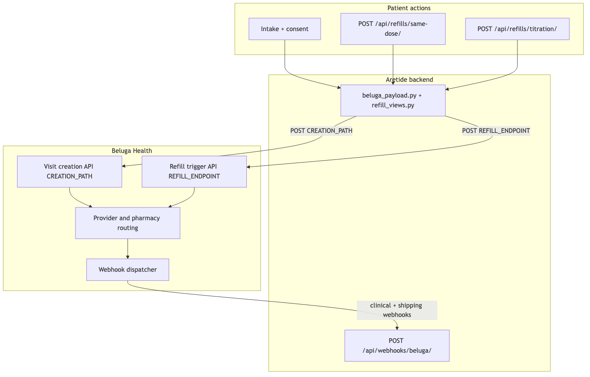
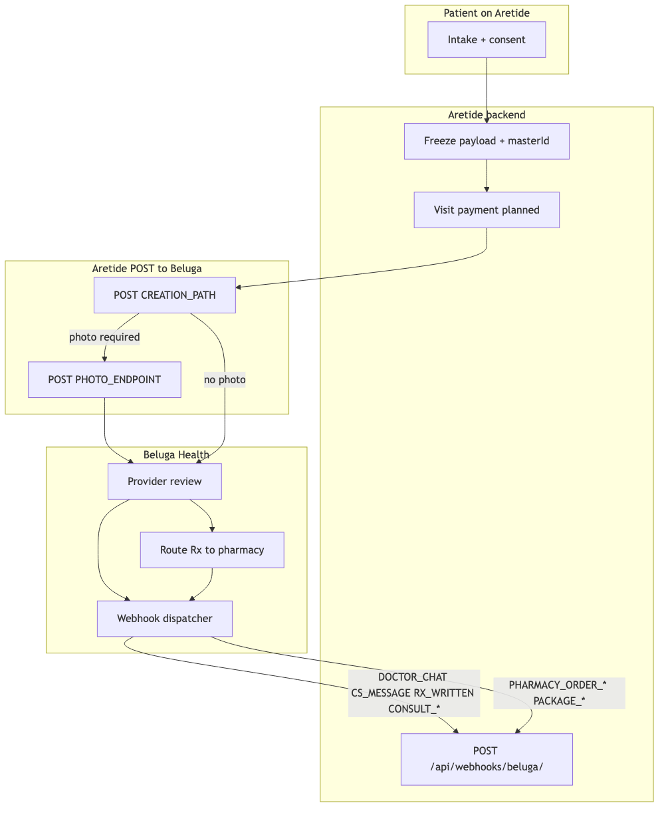
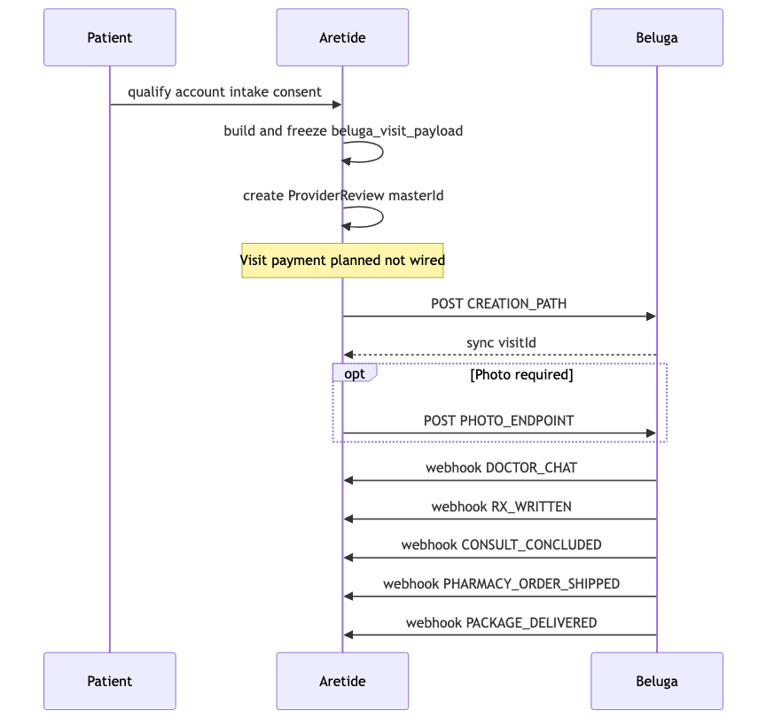
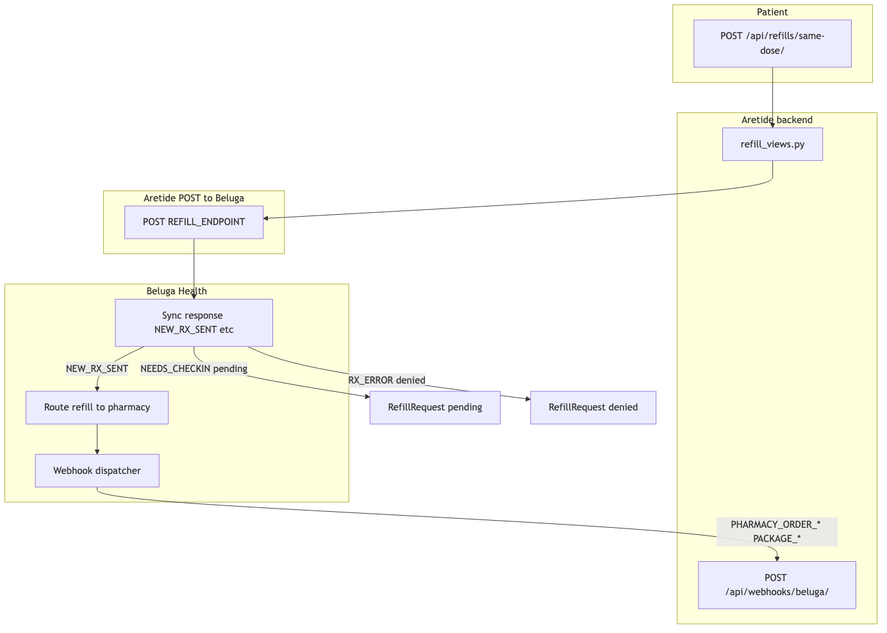
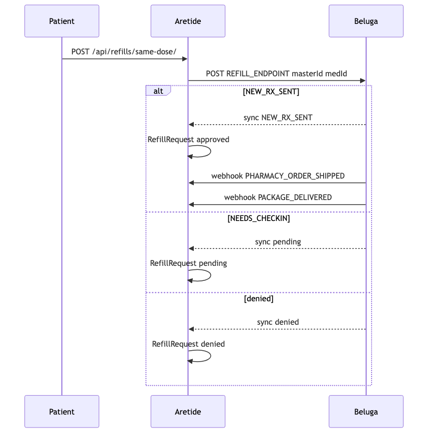
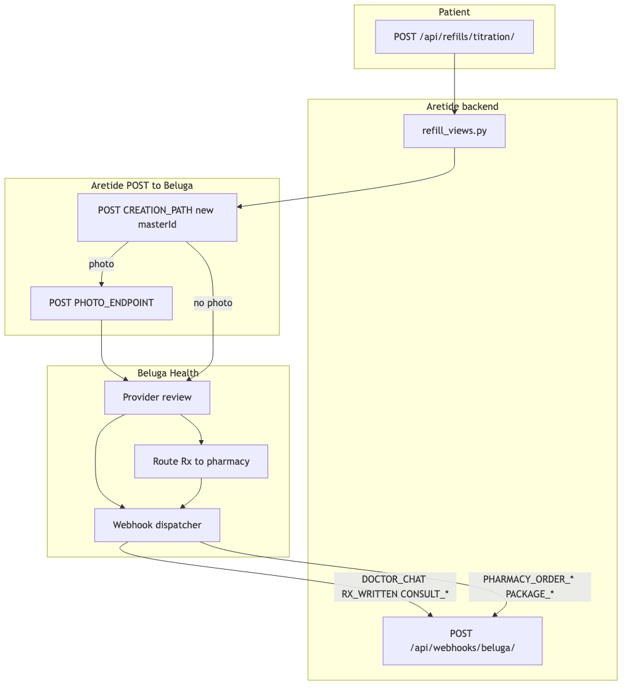
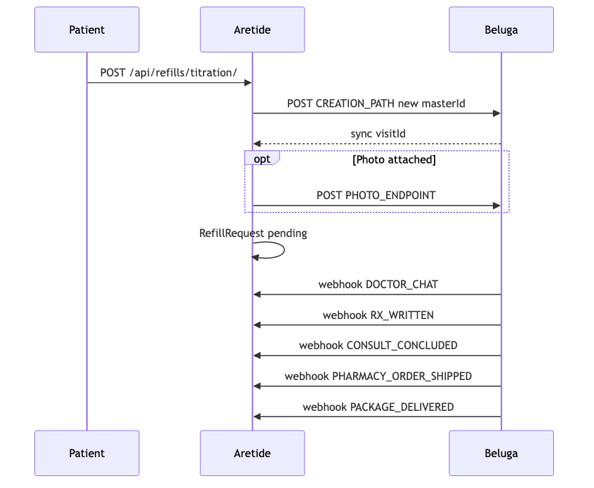

# Beluga Health Integration

Aretide routes clinical review and prescription fulfillment through Beluga Health. Outbound calls go to Beluga only — LifeFile/MediVera adapters exist for reference but are not wired to live outbound flows.

Vendor API reference: `docs/vendor/BELUGA_API.md` (gitignored). Pointer: `docs/BELUGA_API.md`.

---

## What it does

Beluga provides the provider network, visit review, prescription writing, and pharmacy routing for cash-pay telehealth. Aretide builds the patient questionnaire, freezes a Beluga `formObj` at intake submission, POSTs visits to Beluga, and processes inbound webhooks to update review status, prescriptions, shipping timeline, and patient notifications.

---

## Data model (Beluga-related)

| Model | Role |
|-------|------|
| `ProviderReview` | `external_review_id` stores Beluga `masterId` for initial consult and same-dose refills |
| `IntakeSubmission.snapshot` | Frozen `beluga_visit_payload` (`formObj` + metadata) at submit |
| `PatientPrescription` | `beluga_med_id`, `beluga_pharmacy_id` from `RX_WRITTEN` webhook |
| `RefillRequest` | `beluga_master_id`, `beluga_visit_id`, `beluga_order_id`, `beluga_response_status` |
| `PatientCareEvent` | Shipping/fulfillment milestones from Beluga pharmacy webhooks |

`masterId` resolution for inbound webhooks:

1. Titration `RefillRequest.beluga_master_id` (unique per titration visit), or
2. `ProviderReview.external_review_id` (initial consult + same-dose refills share this id).

---

## Flow diagrams

All inbound webhooks hit `POST /api/webhooks/beluga/` → `apply_beluga_webhook()`. Auth: `BELUGA_WEBHOOK_SECRET`.

`masterId` resolution: initial consult + same-dose refills → `ProviderReview.external_review_id`; titration → new `RefillRequest.beluga_master_id` per visit.

Diagrams are **rendered PNGs** (same Mermaid style as `.claude/plans/staff_crm_and_analytics_*.plan.md`). Source: `docs/features/diagrams/*.mmd`. Interactive Plan copy: [`.claude/plans/beluga-integration-flows.plan.md`](../../.claude/plans/beluga-integration-flows.plan.md).

### Overview



---

### New patient — initial consult

Outbound visit creation is **not wired yet**. Payload is built at consent and frozen at submission. Planned trigger: visit payment succeeds (see `.claude/plans/beluga-stripe-payment-pricing.md`).

**Architecture flow**



**Sequence — outbound POSTs and inbound webhooks**



| Phase | Aretide outbound POST | Beluga inbound webhooks |
|-------|----------------------|-------------------------|
| Intake + consent | — | — |
| Submit to Beluga | `POST {BELUGA_CREATION_PATH}` | — |
| Photo (if required) | `POST {BELUGA_PHOTO_ENDPOINT}` | — |
| Provider review | — | `DOCTOR_CHAT`, `CS_MESSAGE` |
| Clinical outcome | — | `RX_WRITTEN`, `CONSULT_CONCLUDED`, `CONSULT_CANCELED` |
| Fulfillment | — | `PHARMACY_ORDER_*`, `PACKAGE_*` |
| Optional | — | `BOOKING_*`, `LAB_ORDER_*` |

---

### Refill patients

#### A. Same-dose refill (implemented)

No consult webhooks — approval/denial comes back **synchronously** in the POST response body.

**Architecture flow**



**Sequence — outbound POST and inbound webhooks**



| Step | Aretide outbound POST | Response / webhooks |
|------|----------------------|---------------------|
| Patient requests refill | `POST {BELUGA_REFILL_ENDPOINT}` | Sync: `NEW_RX_SENT`, `RX_TIME_OUT_OF_RANGE`, `NEEDS_CHECKIN`, … |
| After `NEW_RX_SENT` | — | `PHARMACY_ORDER_*`, `PACKAGE_*` on **original** `masterId` |
| Clinical consult | — | **None** |

#### B. Titration / dose-change check-in (implemented)

Full async provider review on a **new** `masterId` per check-in.

**Architecture flow**



**Sequence — outbound POSTs and inbound webhooks**



| Phase | Aretide outbound POST | Beluga inbound webhooks |
|-------|----------------------|-------------------------|
| Patient submits check-in | `POST {BELUGA_CREATION_PATH}` | — |
| Photo (optional) | `POST {BELUGA_PHOTO_ENDPOINT}` | — |
| Provider review | — | `DOCTOR_CHAT`, `CS_MESSAGE` |
| Clinical outcome | — | `RX_WRITTEN`, `CONSULT_CONCLUDED`, `CONSULT_CANCELED` |
| Fulfillment | — | `PHARMACY_ORDER_*`, `PACKAGE_*` on **titration** `masterId` |

#### C. AutoRx — 6-month protocol (not wired)

| Step | Aretide outbound POST | Response / webhooks |
|------|----------------------|---------------------|
| Trigger shipment | `POST {BELUGA_AUTORX_ENDPOINT}` | Sync: `NEW_RX_SENT`, `NEEDS_CHECKIN`, `MAX_MONTHS_REACHED`, `RX_TIME_OUT_OF_RANGE`, … |
| After `NEW_RX_SENT` | — | `PHARMACY_ORDER_*`, `PACKAGE_*` |
| If `NEEDS_CHECKIN` | Patient completes titration flow B above | Full consult webhooks |

---

### Quick comparison

| | New patient | Same-dose refill | Titration refill |
|--|-------------|------------------|------------------|
| **Patient action** | Intake + consent | `POST /api/refills/same-dose/` | `POST /api/refills/titration/` |
| **masterId** | New → `ProviderReview.external_review_id` | Reuses original | New per visit → `RefillRequest.beluga_master_id` |
| **Outbound POST** | `{BELUGA_CREATION_PATH}` (+ photo) | `{BELUGA_REFILL_ENDPOINT}` | `{BELUGA_CREATION_PATH}` (+ photo) |
| **Sync response** | `visitId` | `NEW_RX_SENT` / deny / pending | `visitId` |
| **Consult webhooks** | Yes | No | Yes |
| **Shipping webhooks** | Yes (original masterId) | Yes (original masterId) | Yes (titration masterId) |
| **Implemented** | Outbound not wired | Yes | Yes |

---

## Initial consult

### Current behavior

| Step | When | What happens |
|------|------|--------------|
| Build payload | Consent signed (`POST /api/consent-records/me/`) | `build_beluga_visit_payload()` assembles `formObj` from questionnaire `beluga:*` mappings |
| Freeze snapshot | Intake submission | Payload stored in `IntakeSubmission.snapshot["beluga_visit_payload"]` |
| Send to Beluga | **Not wired yet** | Submission logs the frozen payload; HTTP POST to Beluga is planned (after payment succeeds per `.claude/plans/beluga-stripe-payment-pricing.md`) |

### Outbound POST — visit creation (required)

```
POST {BELUGA_BASE_URL}/{BELUGA_CREATION_PATH}
Authorization: Bearer {BELUGA_API_KEY}
Content-Type: application/json
```

Request body (summary):

- `formObj` — demographics, clinical fields, optional `patientPreference`, `intakeResults`, or `Q1`/`A1` pairs
- `masterId` — client-generated UUID, unique per visit; stored on `ProviderReview.external_review_id`
- `company` — `BELUGA_COMPANY`
- `visitType` — Beluga-assigned string for GLP-1 initial visit
- `pharmacyId` — optional
- `patientVerified` + `verificationId` — if using ID verification instead of photos

Rules from vendor spec:

- Do not send empty, null, or undefined fields
- Do not put meds/allergies/conditions in Q/A — use dedicated fields only
- Multi-choice Q/A: embed possible answers in `Q1`, semicolon-separated answers in `A1`

### Outbound POST — patient photos (optional)

Required when not using `patientVerified`. Uses `visitId` from creation response.

```
POST {BELUGA_BASE_URL}/{BELUGA_PHOTO_ENDPOINT}
```

JPEG, ≤1000px wide or &lt;3MB, base64-encoded.

### Inbound webhooks (initial consult)

Receiver: `POST /api/webhooks/beluga/` → `apply_beluga_webhook()`.

| Event | Aretide behavior |
|-------|------------------|
| `RX_WRITTEN` | Creates `PatientPrescription`, review → `prescription_sent`, emails patient |
| `CONSULT_CONCLUDED` | `visitOutcome: prescribed` → approved; `referred` → not approved |
| `CONSULT_CANCELED` | Review → `not_approved`, patient notified |
| `DOCTOR_CHAT` | Appends to `review.patient_note`, emails patient |
| `CS_MESSAGE` | Appends support note, emails patient |
| `PHARMACY_ORDER_*` / `PACKAGE_*` | `PatientCareEvent` + email |
| `BOOKING_*` / `NO_SHOW` | Appointment email |
| `LAB_ORDER_*` | Lab email |

---

## Refills

Beluga supports three refill mechanisms. Aretide implements two today.

### A. Same-dose refill (implemented)

**Patient:** `POST /api/refills/same-dose/`

**Outbound:**

```
POST {BELUGA_BASE_URL}/{BELUGA_REFILL_ENDPOINT}
```

```json
{
  "masterId": "ProviderReview.external_review_id",
  "patientPreference": [{ "medId": "active Rx beluga_med_id" }],
  "pharmacyId": "optional"
}
```

Response is **synchronous** — no async doctor-review webhook for approval.

| Beluga status | Aretide `RefillRequest.status` |
|---------------|-------------------------------|
| `NEW_RX_SENT` | `approved` |
| `NO_MORE_REFILLS`, `RX_ERROR`, `RX_MISMATCH`, etc. | `denied` |
| `RX_TIME_OUT_OF_RANGE`, `NEEDS_CHECKIN` | `pending` |

Shipping webhooks still arrive on the same `masterId` after success.

### B. Titration / dose-change check-in (implemented)

**Patient:** `POST /api/refills/titration/` (multipart: weight, side effects, optional photo)

**Outbound #1:** `POST {BELUGA_CREATION_PATH}` with new `masterId`, `visitType` = weightloss check-in, `formObj` including `titration`, weight, BMI, `patientPreference`, Q/A.

**Outbound #2 (optional):** `POST {BELUGA_PHOTO_ENDPOINT}` with `visitId` from creation response.

**Inbound:** full async consult — `DOCTOR_CHAT`, `RX_WRITTEN`, `CONSULT_CONCLUDED`, `CONSULT_CANCELED`, then shipping.

- Each titration visit gets its own `RefillRequest.beluga_master_id`
- `DOCTOR_CHAT` on pending titration → `RefillRequest.status = more_info_needed`

### C. AutoRx — 6-month GLP-1 protocol (not wired)

```
POST {BELUGA_BASE_URL}/{BELUGA_AUTORX_ENDPOINT}
```

Aretide controls each shipment trigger — only call after payment succeeds (hard payment gate). Statuses include `NEW_RX_SENT`, `NEEDS_CHECKIN`, `MAX_MONTHS_REACHED`, `RX_TIME_OUT_OF_RANGE`.

**Refill windows (production):**

| Supply | Min days since last Rx | Max days |
|--------|------------------------|----------|
| 1-month | 15 | 60 |
| 3-month | 60 | 120 |

---

## Other Beluga endpoints (vendor docs — not wired in Aretide)

| Endpoint | Purpose |
|----------|---------|
| `POST {update_visit_endpoint}` | Resend Rx / change pharmacy or SKU |
| `POST {cancel_visit_endpoint}` | Cancel visit by `masterId` |
| `POST {chat_endpoint}` | Send patient message to provider |
| CS message endpoint | Client CS → Beluga admin |
| `POST {pharmacy_list_endpoint}` | Search pharmacies |
| `POST {pdf_endpoint}` | Submit PDF to visit |
| `POST {name_update_endpoint}` | Update patient name on visit |
| Lab results submission | TRT/HRT follow-ups |

**GET (read-only, not wired):**

- `GET /visit/externalFetch/{masterId}`
- `GET /patient/externalFetch/{10-digit-phone}`

---

## Inbound webhook catalog

Register with Beluga: `https://your-domain.com/api/webhooks/beluga/`

Auth: `BELUGA_WEBHOOK_SECRET` (`BelugaWebhookPermission`).

### Clinical

- `CONSULT_CANCELED` — `{ masterId, event }`
- `RX_WRITTEN` — `{ masterId, event, docName, medsPrescribed[] }`
- `CONSULT_CONCLUDED` — `{ masterId, event, visitOutcome: prescribed|referred }`
- `DOCTOR_CHAT` — `{ masterId, event, content }`
- `CS_MESSAGE` — `{ masterId, event, content }`

### Pharmacy / shipping

- `PHARMACY_ORDER_IN_FULFILLMENT` / `PHARMACY_ORDER_SHIPPED` / `PHARMACY_ORDER_DELIVERED` — includes `orderId`, optional `info.carrier` / `info.tracking`
- `PACKAGE_IN_TRANSIT` / `PACKAGE_OUT_FOR_DELIVERY` / `PACKAGE_DELIVERED` / `PACKAGE_DELIVERY_FAILED` — includes `info` with tracker fields

### Booking (sync visits)

- `BOOKING_CREATED` / `BOOKING_RESCHEDULED` — `docName`, `scheduledDate`, `location`
- `BOOKING_CANCELLED` / `NO_SHOW`

### Labs

- `LAB_ORDER_SHIPPED_TO_PATIENT`, `LAB_ORDER_DELIVERED_TO_PATIENT`, `LAB_ORDER_SHIPPED_TO_LAB`, `LAB_ORDER_RECEIVED_BY_LAB`, `LAB_ORDER_RESULTS`, `LAB_ORDER_REQUISITION_CREATED`

### Patient notifications

From `apply_beluga_webhook()`:

- Email on prescription written, consult concluded/canceled, doctor chat, shipping, labs, appointments
- Dashboard care timeline via `PatientCareEvent`
- `RefillRequest.beluga_order_id` linked from fulfillment webhooks for timeline grouping

---

## Environment configuration

| Setting | Purpose |
|---------|---------|
| `BELUGA_BASE_URL` | Staging: `https://api-staging.belugahealth.com`; prod: `https://api.belugahealth.com` |
| `BELUGA_API_KEY` | Bearer token on outbound calls |
| `BELUGA_COMPANY` | Company slug |
| `BELUGA_CREATION_PATH` | Initial consult + titration check-in |
| `BELUGA_REFILL_ENDPOINT` | Same-dose trigger refill |
| `BELUGA_AUTORX_ENDPOINT` | AutoRx shipments |
| `BELUGA_PHOTO_ENDPOINT` | Photo upload |
| `BELUGA_DEFAULT_PHARMACY_ID` | Default pharmacy |
| `BELUGA_WEBHOOK_SECRET` | Inbound webhook auth |
| `BELUGA_VISITTYPE_GLP1_CHECKIN` | Titration visit type |
| `BELUGA_DRUG_CONFIGS` | Per drug-category form flags (titration, weight, photo) |

Exact path strings come from Beluga onboarding.

---

## Implementation status

| Flow | Outbound | Inbound webhooks |
|------|----------|------------------|
| Initial consult | Visit creation POST — **not implemented** | Handler exists |
| Same-dose refill | Implemented | Shipping webhooks handled |
| Titration check-in | Implemented (visit + photo) | Handler exists |
| AutoRx shipments | Not implemented | Would use shipping webhooks |
| Outbound patient chat | Not implemented | `DOCTOR_CHAT` inbound handled |
| Cancel/hold before fulfillment | Not implemented (Slack only per Beluga) | No cancelable webhook yet |

Planned initial-consult trigger (payment plan): consent → visit-fee PaymentIntent → on `payment_intent.succeeded` → Beluga visit POST. Payload is frozen at consent/submission today.

---

## MVP checklist

### Outbound POSTs for GLP-1 MVP

1. Initial visit creation (`BELUGA_CREATION_PATH`) — after payment
2. Optional photo submit (`BELUGA_PHOTO_ENDPOINT`)
3. Same-dose refill — done
4. Titration check-in — done
5. AutoRx — if using 6-month protocol
6. Patient chat outbound — if in-app messaging desired

### Minimum inbound webhooks

- Clinical: `RX_WRITTEN`, `CONSULT_CONCLUDED`, `CONSULT_CANCELED`, `DOCTOR_CHAT`
- Fulfillment: `PHARMACY_ORDER_IN_FULFILLMENT`, `PHARMACY_ORDER_SHIPPED`, `PHARMACY_ORDER_DELIVERED`
- Tracking: `PACKAGE_IN_TRANSIT`, `PACKAGE_OUT_FOR_DELIVERY`, `PACKAGE_DELIVERED`, `PACKAGE_DELIVERY_FAILED`

---

## Staff / dev workflow

- Staff can fire mock Beluga webhooks in dev via `POST /api/staff/dev/beluga-webhook/` and list targets via `GET /api/staff/dev/beluga-mock-targets/`
- Frontend helpers: `fetchBelugaMockTargets`, `fireMockBelugaWebhook` in `src/lib/api/client.ts`
- Beluga payload dev preview: `BelugaPayloadDevTable`, `buildBelugaDoctorReview` in `src/lib/questionnaire/beluga-review.ts`

---

## Key files

| File | Role |
|------|------|
| `docs/vendor/BELUGA_API.md` | Full vendor API reference (gitignored) |
| `backend/apps/integrations/adapters/beluga_client.py` | Outbound POST client |
| `backend/apps/integrations/adapters/beluga.py` | Webhook payload parser |
| `backend/apps/integrations/services.py` | `apply_beluga_webhook()` |
| `backend/apps/integrations/views.py` | `POST /api/webhooks/beluga/` |
| `backend/apps/questionnaires/beluga_payload.py` | Initial consult `formObj` builder |
| `backend/apps/intakes/refill_views.py` | Same-dose + titration refill endpoints |
| `backend/apps/intakes/submissions.py` | Snapshot + frozen payload |
| `backend/apps/consents/views.py` | Payload validation at consent |
| `backend/apps/patients/care_events.py` | Shipping timeline events |
| `backend/apps/patients/notifications.py` | Patient email notifications |
| `src/lib/questionnaire/beluga-review.ts` | Dev payload review + Q/A assembly |
| `src/lib/api/client.ts` | Frontend refill API + staff mock tools |

---

## Related docs

- `docs/features/medical-intake.md` — intake funnel and payload freeze at consent
- `.claude/plans/beluga-stripe-payment-pricing.md` — payment gating + Stripe architecture
- `backend/CLAUDE.md` — Beluga-only outbound policy
